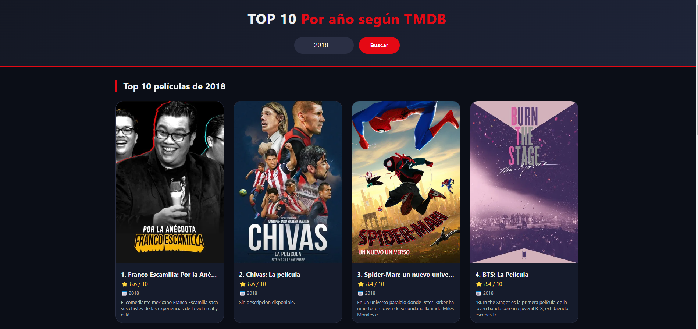
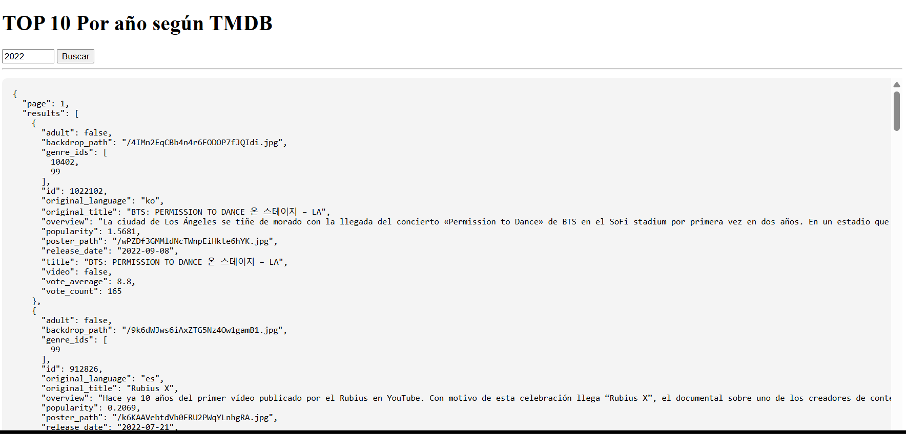

# Top 10 películas por año

[](https://developers.themoviedb.org/3)
[](https://developer.mozilla.org/es/docs/Web/JavaScript)
[](https://developer.mozilla.org/es/docs/Web/CSS)

Aplicación web sencilla y elegante que muestra el **Top 10 de películas por año** utilizando la API de **TMDB (The Movie Database)**. Diseño oscuro, responsivo y fácil de usar.


*Vista principal de la aplicación*

---

## Características

- **Búsqueda por año** (desde 1900 hasta el año actual).
- **Top 10 películas** con mejor rating (mínimo 100 votos).
- **Póster**, título, puntuación, año y descripción corta.
- **Diseño responsivo** (se adapta a móviles, tablets y escritorio).
- **Mensajes de error** claros (API inválida, sin resultados, etc.).
- **Código limpio** y separado en HTML, CSS y JS.


---

## Tecnologías utilizadas

- **HTML5** semántico
- **CSS3** (Flexbox, Grid, variables CSS)
- **JavaScript ES6+** (async/await, fetch)
- **TMDB API v3** (datos de películas)

---

## Configuración de la API (TMDB)

Este proyecto requiere una **clave de API gratuita** de TMDB. Sigue estos pasos:

1. **Regístrate** en [TMDB](https://www.themoviedb.org/signup) (solo email y contraseña).
2. **Confirma tu cuenta** mediante el enlace que recibirás por correo.
3. **Inicia sesión** y ve a [Configuración → API](https://www.themoviedb.org/settings/api).
4. En la sección **"Developer"**, haz clic en **"Crear"** (o "Create").
5. Completa el formulario:
   - **Tipo de uso:** "Developer"
   - **Nombre de la aplicación:** `Top 10` (o el que quieras)
   - **URL de la aplicación:** (puedes dejar en blanco o poner tu GitHub Pages)
   - **Descripción breve:** `Top 10 películas por año`
    
6. Haz clic en **"Guardar"** y copia tu **API Key (v3 auth)** (un string como `abc1234567...`).


> ⚠️ **No compartas tu API key públicamente** si subes el código a GitHub. Para proyectos personales no hay problema, pero si es público, restríngela por dominio en la misma página de API de TMDB.

---

## API utilizada
```
Endpoint: https://api.themoviedb.org/3/discover/{año}

Ejemplo:
https://api.themoviedb.org/3/discover/2026
```

## EJEMPLO

(https://api.themoviedb.org/3/discover/movie?api_key=673a9b11b53e35ee4a76aaffc34109ef&language=es-ES&sort_by=vote_average.desc&vote_count.gte=100&primary_release_year=2024&page=1)

## Resultado
```
json
{
  "page": 1,
  "results": [
    {
      "id": 123456,
      "title": "Dune: Parte 2",
      "vote_average": 8.9,
      "release_date": "2024-02-28",
      "overview": "Paul Atreides se une a los Fremen...",
      "poster_path": "/8b8R8l88Qje9dnbOBYFmJoaU9k3.jpg",
      "original_language": "en"
    }
  ],
  "total_pages": 5,
  "total_results": 45
}
```

## Estructura del proyecto

```
API-RESTFUL-API-SODA-PROJECT/
├──API REST
   ├── index.html # Estructura principal
   ├── styles.css # Estilos visuales
   ├── app.js # Lógica y llamadas a la API
   ├──  README.md # Documentación`

```
---

##  Instalación y uso local

Sigue estos pasos para ejecutar la aplicación en tu ordenador:

1. **Clona o descarga** este repositorio.
   ```bash
   git clone https://github.com/tuusuario/ API-REST-API-SODA-PROJECT.git
   cd API-REST-API-SODA-PROJECT
   
2. **Abre el archivo app.js** con cualquier editor de texto.
3. Pega tu API key de TMDB donde dice `TU_API_KEY_AQUI`:
    ```bash
    const API_KEY = "TU_API_KEY_AQUI";  // <-- reemplázala

4. **Guardar los cambios**
  
5. Abre **index.html** en tu navegador (doble clic o con Live Server de VS Code).

6. Prueba escribiendo un año (ej. 2024) y haz clic en **Buscar**.

7. No necesitas instalar nada más. La app funciona directamente en el navegador.
 
# Consultas de top 10 de peliculas segun el año en JSON:


 # Créditos
- Desarrollador: [Diego Barrios]
- API: The Movie Database (TMDB)


   
