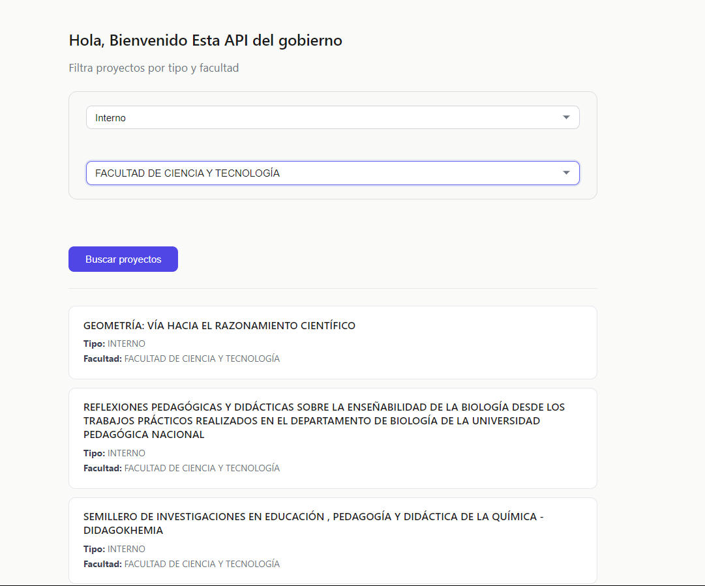

# Proyectos de Investigación – Datos Abiertos Colombia


Aplicación web que consulta el portal de **Datos Abiertos del Gobierno Colombiano** (API SODA) y filtra proyectos de investigación por **tipo de proyecto** (cofinanciado/interno) y **unidad académica** (facultad).

---

## Proyecto: Filtro de Proyectos de Investigación


### Descripción
Herramienta que permite filtrar proyectos de investigación publicados por una entidad gubernamental. El usuario selecciona:
- **Tipo de proyecto:** Cofinanciado o Interno.
- **Facultad:** Unidad académica específica.

Al hacer clic en "Buscar proyectos", la app consulta la API y muestra los proyectos que coinciden con ambos filtros.

### Tecnologías
- HTML5
- CSS3 (diseño limpio, bordes redondeados, inputs personalizados)
- JavaScript ES6+ (fetch, manipulación del DOM, normalización de texto)

### Cómo Usar
1. Abre `gov.html` en tu navegador.
2. Selecciona el **tipo de proyecto** (Cofinanciado / Interno).
3. Selecciona la **facultad** de la lista desplegable.
4. Presiona el botón **"Buscar proyectos"**.
5. Visualiza los resultados: título del proyecto, tipo y facultad.

### API Utilizada
```
Dataset: Proyectos de investigación (fuente: Datos Abiertos Colombia)
Endpoint: https://www.datos.gov.co/resource/wy5g-wxbb.json
```

### Consulta SQL embebida en la URL:
```
?$query=SELECT nro, tipo_de_proyecto, c_digo_del_proyecto, proyecto_de_investigaci_n, unidad_academica
```
### Ejemplo completo:
```
https://www.datos.gov.co/resource/wy5g-wxbb.json?$query=SELECT nro, tipo_de_proyecto, c_digo_del_proyecto, proyecto_de_investigaci_n, unidad_academica
```

### Respuesta de Ejemplo (resumida)
```
[
  {
    "nro": "1",
    "tipo_de_proyecto": "COFINANCIADO",
    "c_digo_del_proyecto": "INV-001",
    "proyecto_de_investigaci_n": "Estudio de biodiversidad en la región",
    "unidad_academica": "FACULTAD DE CIENCIA Y TECNOLOGÍA"
  },
  {
    "nro": "2",
    "tipo_de_proyecto": "Interno",
    "c_digo_del_proyecto": "INV-002",
    "proyecto_de_investigaci_n": "Innovación educativa",
    "unidad_academica": "FACULTAD DE EDUCACIÓN"
  }
]
```


# Conceptos Clave
### Fetch API (GET)
```
fetch(URL)
    .then(response => response.json())
    .then(data => console.log(data))
    .catch(error => console.error(error));
```


### Normalización de texto (quitar acentos y mayúsculas)
```
function limpiar(texto) {
    return texto?.normalize("NFD").replace(/[\u0300-\u036f]/g, "").trim().toUpperCase();
}
```

### Filtrado con múltiples condiciones
```
if (tipoAPI === tipoUser && unidadAPI === unidadUser) {
    // Mostrar proyecto
}
```

### Creación dinámica de elementos en el DOM
```
const div = document.createElement("div");
div.innerHTML = `<h3>${titulo}</h3><p>${contenido}</p>`;
resultados.appendChild(div);
```
---
### Personalización
* Agregar más filtros: Puedes añadir nuevos ***Select*** y modificar la condición del ***if***.
* Cambiar la consulta SQL: Edita el parámetro ***$query*** en la URL para seleccionar otras columnas.
* Modificar estilos: Edita el archivo ***style.css*** (variables de color, bordes, fuentes).

# Créditos
* Desarrollador: ***Richard Montes***
* Fuente de datos: Datos Abiertos Colombia
* API utilizada: SODA (Socrata Open Data API)

⭐ Si te gusta este proyecto, dale una estrella en GitHub.